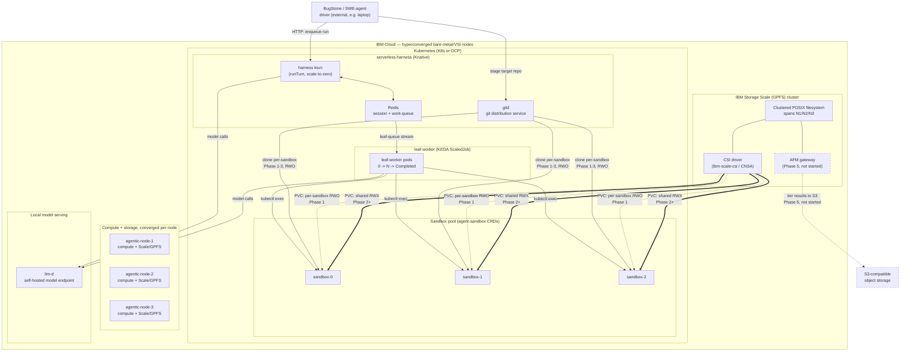

# Environment diagram — GPFS/Storage Scale + serverless-harness

Supports the [GPFS/Scale shared-agent-context slide deck](../presentations/2026-07-17-gpfs-scale-shared-agent-context.md)
(Slide 12). Local/fork-only while in draft.

## Environment overview

## Notes

- **Hyperconverged**: compute and Storage Scale are colocated on the same 3 nodes
  (`agentic-node-1/2/3`) — no separate storage tier/appliance.
- **CSI driver**: labeled `ibm-scale-csi` in this cluster's `StorageClass`
  (provisioner `spectrumscale.csi.ibm.com`); functionally the same integration path as
  CNSA (Container Native Storage Access) on OCP — diagram is agnostic to which.
- **Solid arrows** = built/proven. **Dashed** = Phase 1 baseline being superseded, or
  not-yet-started (AFM/S3, Phase 5).
- **Double arrows (`==>`)** = the Phase 2+ shared-RWX path this effort is validating.
- **llm-d** is local/self-hosted — no external model API in the loop, relevant for both
  cost and for keeping the whole demo environment self-contained on this cluster.
- K8s vs. OCP: today's `agentic-cloud` cluster is plain k3s; the diagram uses "K8s or OCP"
  because the harness supports both install paths (`setup-k8s.sh` / `setup-ocp.sh`) and
  this environment isn't tied to one.

---

*Assisted-By: Claude (Anthropic AI) <noreply@anthropic.com>*
