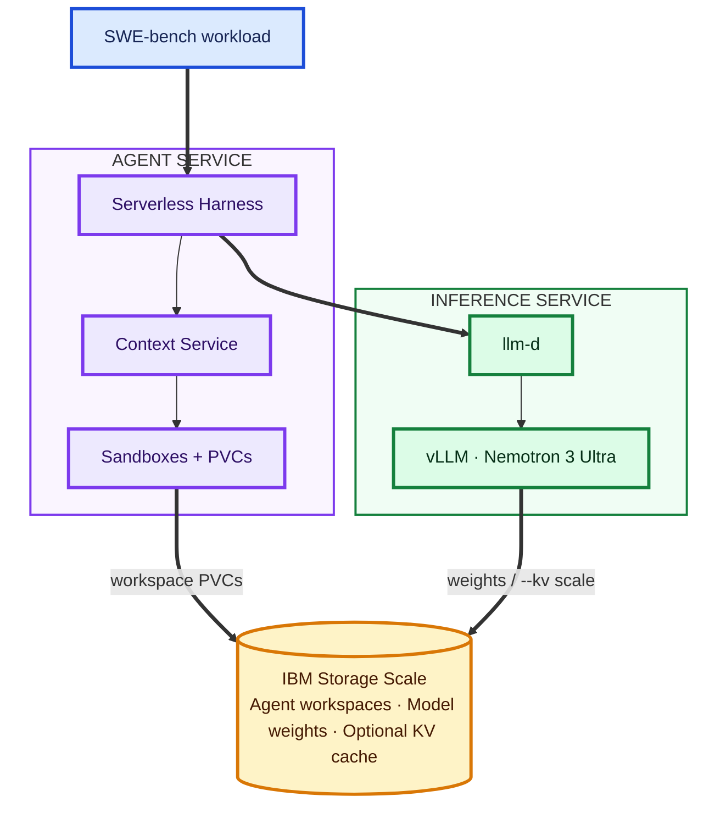

# Agentic Scale experiment

This demo runs a real SWE-bench task in Serverless Harness, stores its workspace on IBM Scale,
and uses Nemotron 3 Ultra through llm-d for inference.

Everything in this directory is specific to the `agentic-node` Scale/llm-d experiment. The
general SWE-bench dataset, evaluator, and harness remain under `experiments/swebench`.

## Architecture



Serverless Harness sends model requests to llm-d. Context Service creates the Sandboxes and their
PVC-backed workspaces. Scale stores those workspaces and the model weights; it also becomes the
vLLM filesystem KV tier when the run selects `--kv scale`.

## Verified baseline

- Kubernetes context: `agentic-cloud`
- Scale filesystem: `fs1`
- Model: `nvidia/nemotron-3-ultra`
- Instance: `django__django-13410`
- Result: solved in about 150 seconds with a 755-byte patch
- Validation: all 42 relevant Django tests passed

## Run one task

From the repository root, this selects the local NVMe KV tier and asks Context Service to create
the Sandbox and its Scale-backed PVC workspace:

```bash
./experiments/agentic-scale/swebench-run.sh --kv local
```

`--kv memory`, `--kv local`, and `--kv scale` select GPU/CPU memory only, local NVMe, or a
Scale-backed filesystem tier respectively. Changing modes restarts Nemotron and waits for it to
become ready. The first `--kv scale` run creates its Scale-backed KV PVC automatically.

The runner prints four quiet milestones. For Kubernetes details in another terminal, use the
run-specific dashboard command printed at startup.

Results are written beneath `/tmp/serverless-harness-swebench/$RUN_ID`, including
`summary.json`, `workspace.json`, `predictions.jsonl`, and `evaluation.txt`.

Confirm that the dynamically provisioned workspace is backed by Scale:

```bash
RUN_ID=<run-id-printed-above>
jq . "/tmp/serverless-harness-swebench/$RUN_ID/workspace.json"
```

The storage class should be `ibm-scale-csi` and the claim should be `Bound` to a volume.

## Scale the run

`CONCURRENCY` is the number of agents running simultaneously. `POOL_SIZE` is the number of
isolated Sandbox/PVC workspaces. This runs four independent attempts of the selected instance:

```bash
AGENTS=4 SANDBOXES=4 EVALUATE=0 \
  ./experiments/agentic-scale/swebench-run.sh --kv local
```

For multiple distinct repositories/issues, use the deck-driven experiment described in
[`experiments/swebench/RUNBOOK.md`](../swebench/RUNBOOK.md). The current KEDA
`leaf-worker` configuration caps concurrent worker Jobs at 10.

## Plan repository-diverse cache load

These controls intentionally describe different dimensions:

- `REPOS`: number of distinct codebases, which increases prompt diversity.
- `TASKS`: number of distinct issues spread round-robin across those repositories.
- `AGENTS`: maximum simultaneous agent jobs.
- `SANDBOXES`: isolated pod/PVC workspaces available to agents.
- `REPEATS`: repetitions of the selected workload, useful for measuring reuse.

Create a deterministic 12-task selection across four repositories:

```bash
REPOS=4 TASKS=12 AGENTS=4 SANDBOXES=4 REPEATS=1 \
  ./experiments/agentic-scale/swebench-plan.sh
```

The bundled deck currently contains 24 issues across eight repositories. `swebench-plan.sh` writes a
reduced deck under `/tmp` and prints the exact repository distribution. This selection step is
ready; executing a heterogeneous batch on `agentic-node` additionally requires deploying the
universal SWE-bench sandbox image. The single-task runner uses an official per-instance image,
which cannot safely execute arbitrary repositories.

## Inspect and exercise the filesystem KV cache

```bash
./experiments/agentic-scale/inspect-kv-cache.sh
./experiments/agentic-scale/benchmark-kv-cache.sh
```

The first command is read-only. It selects the Nemotron decode pod, enters its `vllm` container,
and reports `/mnt/kv-cache` disk usage and file count. It does **not** create cache data or prove
reuse. The benchmark sends repeated identical prompts and prints vLLM counters before and after;
nonzero external cache hits after a pod restart are the proof of filesystem readback.

The deployed cache path maps to `/mnt/llm-d-cache/nemotron-ultra` on `agentic-node-1`. Model
weights remain on Scale. The active KV path is GPU HBM -> shared CPU memory -> local NVMe using
vLLM's `OffloadingConnector`, `TieringOffloadingSpec`, and built-in `fs` tier.

## Limits

Context Service dynamically provisions each Sandbox workspace through `ibm-scale-csi`. The
static-PV helper remains available only as a diagnostic fallback. The local filesystem KV tier is
node-local and is not shared between replicas.
